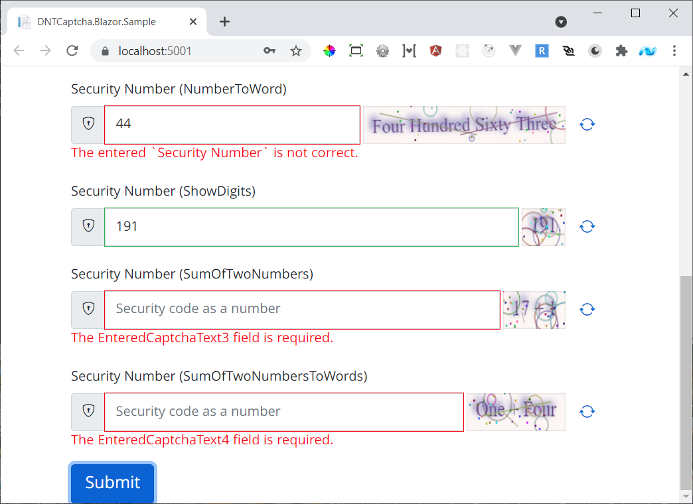

## DNTCaptcha.Blazor

<p align="left">
  <a href="https://github.com/VahidN/DNTCaptcha.Blazor">
     
  </a>
</p>

`DNTCaptcha.Blazor` is a captcha generator for the Blazor based applications. It uses the standard [HTML5 Canvas API](https://developer.mozilla.org/en-US/docs/Web/API/Canvas_API) to draw the captcha and that's why it's compatible with both Blazor WASM and Server apps. It no longer uses the `System.Drawing.Common` package which has serious cross platform and stability issues.

## Install via NuGet

To install DNTCaptcha.Blazor, run the following command in the Package Manager Console:

[](https://github.com/VahidN/DNTCaptcha.Blazor)

```powershell
PM> Install-Package DNTCaptcha.Blazor
```

You can also view the [package page](http://www.nuget.org/packages/DNTCaptcha.Blazor/) on NuGet.

## Usage

After installing the DNTCaptcha.Blazor package, add the following definition to the \_Imports.razor file:

```csharp
@using DNTCaptcha.Blazor
```

Then to use it, add its new tag and settings to [your view](src/DNTCaptcha.Blazor.WasmSample/Client/Pages/Components/Login.razor).
Here you will need [two properties](src/DNTCaptcha.Blazor.WasmSample/Shared/ViewModels/LoginViewModel.cs) and one `Compare` attribute to work with it:

```csharp
[Required]
[Compare(nameof(CaptchaText1), ErrorMessage = "The entered `Security Number` is not correct.")]
public string EnteredCaptchaText1 { set; get; }

public string CaptchaText1 { set; get; }
```

```xml
<EditForm Model="Model" OnValidSubmit="DoLoginAsync">
    <InputText name="SecurityNumber" @bind-Value="Model.EnteredCaptchaText1" />
    <DntInputCaptcha @bind-Value="Model.CaptchaText1" />
```

The `EnteredCaptchaText1` will receive the entered text from the user and the `CaptchaText1` contains the automatically generated captcha code.
Now the `Compare` attribute will compare these two values during the `OnValidSubmit` event to provide an standard and clean validation.

## Supported Languages

You can find all of the currently supported languages [here](src/DNTCaptcha.Blazor/Contracts/NumberToWordLanguage.cs).
To add a new language, kindly contribute by editing the following files:

- [Language.cs](src/DNTCaptcha.Blazor/Contracts/NumberToWordLanguage.cs)
- [HumanReadableIntegerProvider.cs](src/DNTCaptcha.Blazor/Providers/HumanReadableIntegerProvider.cs)

## Samples



- [Blazor WASM Sample](src/DNTCaptcha.Blazor.WasmSample/)
- [Blazor Server Sample](src/DNTCaptcha.Blazor.ServerSample/)

## Demo

[You can see a demo of this component with all of its different supported DisplayModes here](https://vahidn.github.io/DNTCaptcha.Blazor)
